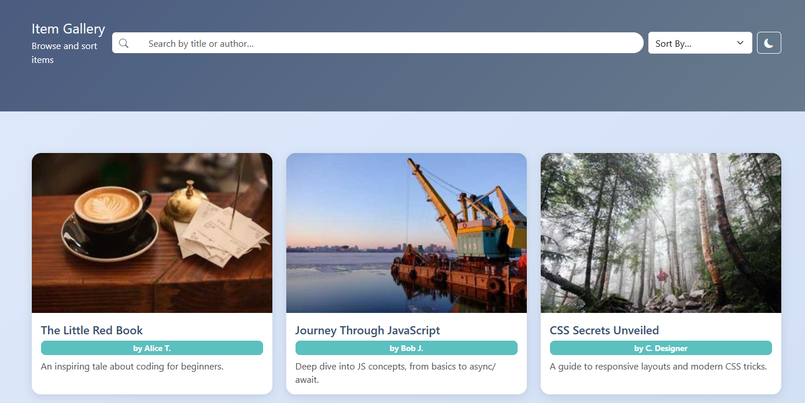
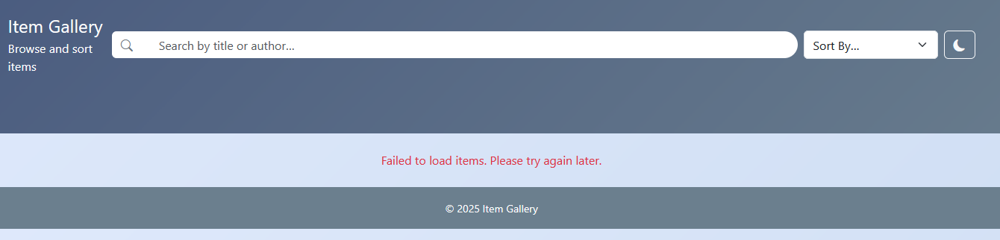
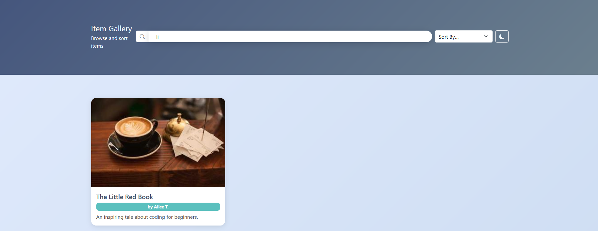
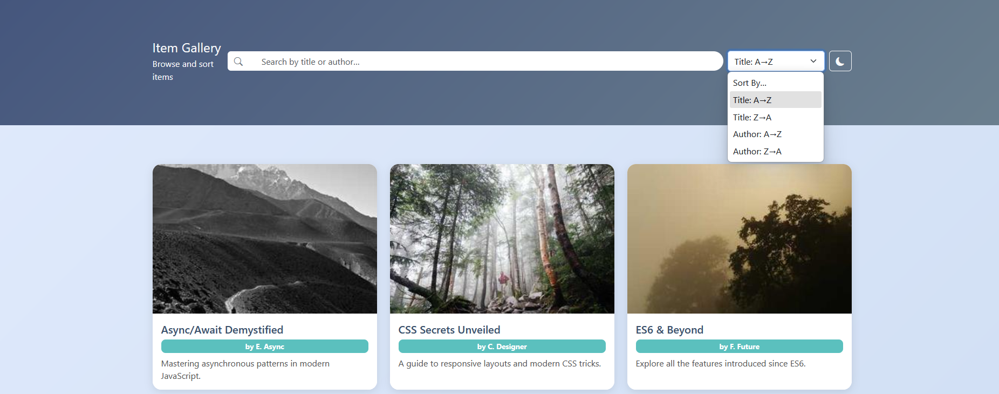
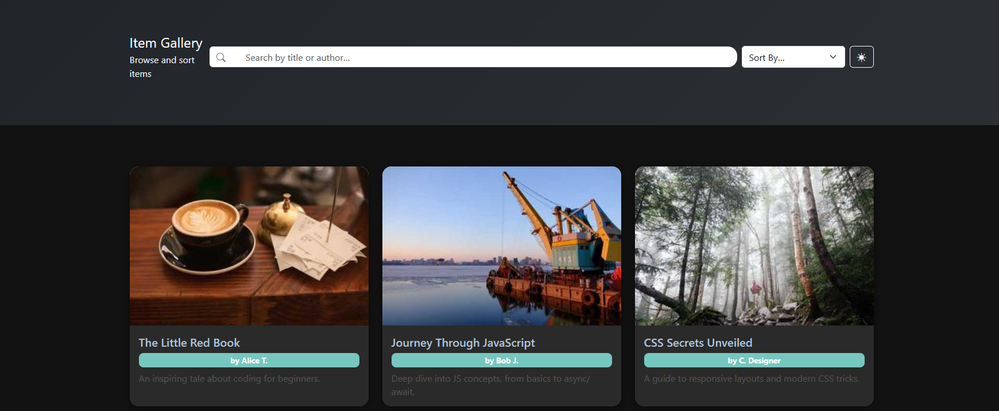
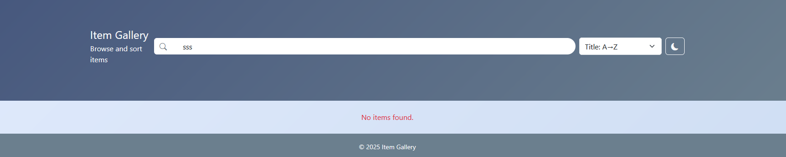

# app.js Functionality

A brief overview of what `app.js` does in this project.

## Features

- **Fetch & Render**
  - Loads `data/items.json`
  - Displays each item as a card with image, title, author, and description
  - Shows an error message in the designated container if the fetch fails
  

- **Live Search**
  - Filters displayed cards in real time
  - Matches against title or author as you type
  

- **Sorting**
  - Sorts the current (and possibly filtered) list by:
    - Title A → Z / Z → A
    - Author A → Z / Z → A
    

- **Dark / Light Theme Toggle**
  - Switches between dark mode and light mode (class name for icon: "bi bi-sun-fill" / "bi bi-moon-fill")
  - Saves the chosen theme in `localStorage` so it persists after reload (learn about localStorage)
  

- **Error Handling**
  - Displays “No items found.” when no cards match the current search/sort
  - Hides broken images so their alt text becomes visible
  

## Usage Flow

1. **Page Load**
   - Fetch JSON data
   - Render all cards
   - Apply stored theme from `localStorage` (Dark or Light)

2. **Search Input**
   - Instantly filters cards as the user types

3. **Sort Dropdown**
   - Reorders the (possibly filtered) cards upon change

4. **Theme Button**
   - Toggles between dark/light mode and updates `localStorage`

5. **Empty Results**
   - If no cards match, shows “No items found.”